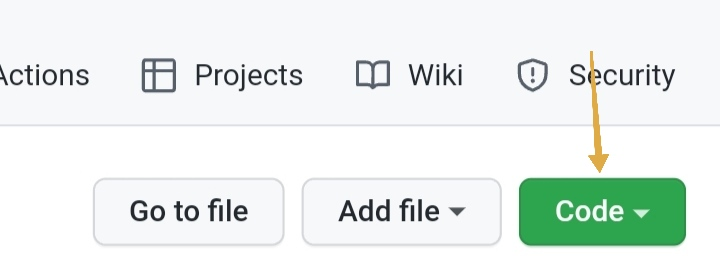

## Introduction to Github
The following is the list of to-dos in this article

- Introduction (What is Github?)
- Why Github
- Git vs Github vs Gitlab
- Cloning a git repository
- Making a commit in Git
- Making a pull request in git
- Github desktop vs Github CLI
- Git extension in VSCode
- Conclusion

# Introduction (What is Github?)
According to official Github [documentation](https://docs.github.com/en/get-started/quickstart/hello-world), "Github is a code hosting platform for version control and collaboration. It lets you and others work together on projects from anywhere in the world."
This article will focus on the version control aspect of Github, before that, let's understand some terms.
What is version control and version control software?
Version (or source) control is a method/way of keeping changes (made by different collaborators) to a project (might be software source code, documentation of software, etc) up-to-date.
Version control software is a software that performs version control. In other words, it is a software that keeps changes made to a project (codebase, documentation) up-to-date.

# Git vs Github vs Gitlab
Git is the most widely used Distributed Version Control System. According to Wikipedia, a DVCS is a form of version control in which the complete project (codebase, documentation, etc), including its history (all previous commits made to the project) is mirrored on every collaborator's computer (local repository).

Github is a software development platform implemented with Git (the most popular version control software). Github makes keeping track of changes in a project very easy for collaborators with friendly interface, easy to understand wording and an amazing documentation on its usage. Its mostly used by developers.

Gitlab is also a version control system implemented with Git and code collaboration platform, but mostly for DevOps activities.

# Cloning a Git repository
The following are steps to clone a repository(project) from Github;
- Visit the link to the project, mostly in this format " https://github.com/(user/organization-name/project-name) ", for example "https://github.com/ookannumber1/TechnicalWritingCohort" would redirect to the repository of this article.
- **Click the "Code" button (arrowed) on the repository page**.

-  **Click the copy icon(arrowed) to copy the .git link of the repository**.

- **Go to where you want to clone the repository to on your computer and go to the terminal from there**.

- **Input the following command `git clone <the .git link copied earlier>` and press ENTER.**

- **If successful, your output should be as the image below.**

# Making a commit and push in Git CLI
Commits are made after changes are made to a project, they are a way to keep track of changes made and its author to a project.
The following are steps to make a commit in Github;
1. After changes are made to a project, you have to stage them with this git command in your terminal (at the directory of the project on your computer) `git add .`, the command will stage all changes made.
2. You have to now commit the staged changes, a commit should have a message. Make a commit with message with the following git command; `git commit -m "<commit message here>" `
3. To make the changes made on your computer (local repository) reflect on Github, you have to push to Github with the following command; `git push`

# Making a pull request in Git
Git allows many collaborators to work on a project simultaneously, with each collaborators on different aspect of the project, Pull request is made when a collaborator is through with his task and ready to submit for review before its going to be merged with the main project.
The following steps are steps to make a pull request in Github;
- **Click the "Contribute" button on the repository you want to submit from.**

- **Click the "Open pull request" button.**

- **Scroll down and press the "Create pull request" button.**

# Github desktop vs Github CLI
Github desktop is a software that makes interaction (cloning repositories, making commits, etc) with Github easier for users that are not conversant with running git commands in the terminal with eye pleasing user interface.

Github CLI is a way to interact with Github from the command line interface (terminal) from the root directory of the project by running git commands to clone repositories, commit changes, push to remote repositories.

# Using VSCode's source control view
Third icon on the VSCode side bar gives the Source Control View
A number (number of files in which changes have been made) is displayed over the version control icon.
Follow the following steps to commit changes and push to Github;
1. Click the source control icon.
2. Input the commit message in the text area.
3. When satisfied with the commit message, click the done icon to make the commit.

- Click the "**Sync**" button to make the committed changes reflect on Github.
Syncing is equivalent to running "git push" when using command line interface.

# Conclusion
Version (Source) Control has made a great impact in making collaborating between co-workers very easy and efficient in today's world of software development and documentation of software products. WIth version control (like git), changes are well monitored and documented, bugs are now more traceable as every commited changes are known (as well as the author of the buggy commit).